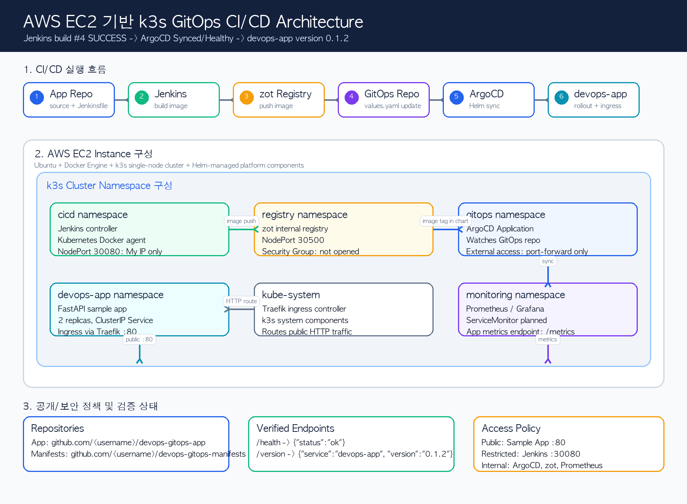
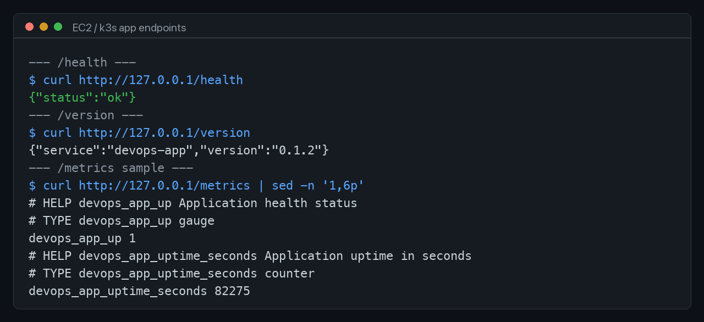
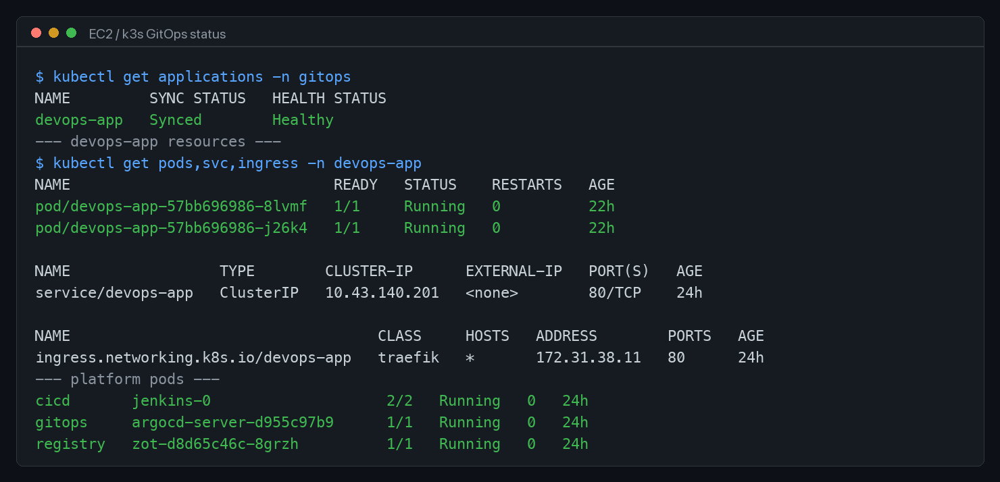
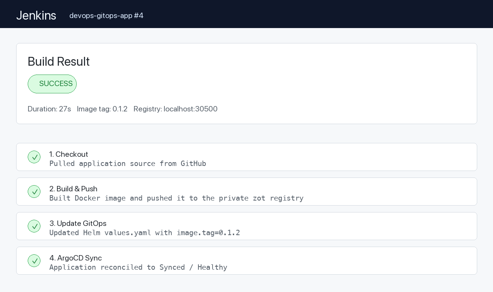

# EC2 k3s GitOps CI/CD Platform

AWS EC2 위에 단일 노드 k3s 클러스터를 구성했습니다.
Jenkins, Helm, ArgoCD, private container registry를 연결했습니다.
애플리케이션 배포 흐름은 GitOps 방식으로 자동화했습니다.

이 README는 구성 과정에서 알게 된 내용을 정리한 문서입니다.
같은 구조를 만들 때 참고할 수 있도록 명령어와 확인 방법을 함께 남겼습니다.

이 프로젝트의 목적은 GitOps의 흐름을 직접 이해하는 것입니다.
작은 구조로 먼저 만들고 경험해보아야 큰 구조에도 쉽게 적응할 수 있을 것이라고 생각했습니다. 

## 구성하면서 알게 된 점

GitOps는 여러 컴포넌트가 연결된 배포 운영 방식입니다.

Jenkins는 이미지를 빌드하는 역할을 맡습니다.
Registry는 빌드된 이미지를 저장하는 역할을 맡습니다.
Helm chart는 Kubernetes 리소스를 선언하는 역할을 맡습니다.
GitOps repository는 배포하려는 상태를 기록하는 역할을 맡습니다.
ArgoCD는 Git의 상태를 클러스터에 반영하는 역할을 맡습니다.
Kubernetes namespace는 컴포넌트의 책임 범위를 나누는 역할을 맡습니다.

EC2 한 대와 k3s를 선택한 이유도 이 흐름을 잘 보기 위해서입니다.
관리형 Kubernetes를 바로 사용하면 편리합니다.
작은 클러스터를 직접 구성하면 기본 요소가 더 잘 보입니다.
Docker 권한, kubeconfig, NodePort, Ingress, namespace, Helm release를 직접 확인할 수 있습니다.
규모는 작게 잡았습니다.
배포 흐름은 실제 GitOps 구조와 같게 가져갔습니다.

## 기술적으로 확인한 부분

GitOps에서는 Git repository가 배포 기준점이 됩니다.
클러스터에서 직접 리소스를 수정하면 Git의 상태와 클러스터 상태가 달라집니다.
ArgoCD는 이 차이를 감지합니다.
자동 동기화를 켜면 ArgoCD가 Git의 상태를 다시 클러스터에 반영합니다.
`selfHeal`은 클러스터의 수동 변경을 되돌리는 데 사용됩니다.
`prune`은 Git에서 제거된 리소스를 클러스터에서도 제거하는 데 사용됩니다.

Jenkins는 애플리케이션 코드를 기준으로 이미지를 만듭니다.
Jenkins는 이미지를 registry에 push합니다.
Jenkins는 Kubernetes 리소스를 직접 수정하지 않습니다.
Jenkins는 GitOps repository의 Helm values만 수정합니다.
이렇게 나누면 CI와 CD의 책임이 분리됩니다.

Helm chart는 Kubernetes manifest를 템플릿으로 관리합니다.
이미지 repository와 tag는 `values.yaml`에서 관리합니다.
Jenkins Pipeline은 배포할 이미지 tag만 변경합니다.
ArgoCD는 변경된 chart 값을 기준으로 배포를 수행합니다.
이미지 tag를 바꾸면 어떤 버전이 배포되었는지 추적하기 쉽습니다.
`latest` tag만 사용하면 배포 이력을 확인하기 어렵습니다.

애플리케이션 Service는 `ClusterIP`로 구성했습니다.
클러스터 내부 통신은 Service를 통해 처리됩니다.
외부 HTTP 접근은 Traefik Ingress를 통해 처리됩니다.
Jenkins는 NodePort로 열었습니다.
ArgoCD는 기본적으로 외부에 열지 않았습니다.

Deployment에는 readiness probe를 넣었습니다.
readiness probe는 트래픽을 받을 준비가 되었는지 확인합니다.
Deployment에는 liveness probe도 넣었습니다.
liveness probe는 컨테이너가 정상 상태인지 확인합니다.

`resources.requests`와 `resources.limits`를 설정했습니다.
`requests`는 스케줄링 기준이 됩니다.
`limits`는 컨테이너가 사용할 수 있는 최대 자원을 제한합니다.
단일 노드에서는 이 설정이 더 중요합니다.

`/metrics` endpoint를 추가했습니다.
Prometheus가 수집할 수 있는 형식으로 metric을 노출했습니다.
ServiceMonitor manifest는 조건부로 생성되도록 구성했습니다.
Prometheus Operator CRD가 없으면 ServiceMonitor를 비활성화해야 합니다.
CRD가 없는 상태에서 ServiceMonitor를 배포하면 ArgoCD sync가 실패할 수 있습니다.

## 구현 범위

- EC2 한 대에서 Kubernetes 기반 CI/CD 환경 구성
- Jenkins Pipeline으로 Docker image build/push 자동화
- Helm chart로 Kubernetes 리소스 선언 관리
- ArgoCD로 GitOps 기반 배포 자동화
- Jenkins는 제한된 외부 접근이 가능하도록 구성
- 애플리케이션은 HTTP Ingress로 접근 가능하도록 구성
- ArgoCD는 port-forward 중심으로 접근
- Registry는 클러스터 내부 사용을 기준으로 구성
- Prometheus 연동을 위해 `/metrics` endpoint 제공
- ServiceMonitor는 Prometheus Operator 설치 후 활성화 가능하도록 준비

## Architecture

```text
Developer
  |
  | push app source
  v
GitHub App Repo
  |
  | Jenkins Pipeline
  v
Jenkins on k3s
  |
  | docker build / push
  v
Private Registry(zot)
  |
  | update image tag in Helm values
  v
GitHub GitOps Repo
  |
  | sync
  v
ArgoCD
  |
  | helm deploy
  v
k3s devops-app namespace
```

## Repository Layout

```text
.
├── apps/
│   └── devops-app/                 # sample app Helm chart
│       ├── Chart.yaml
│       ├── values.yaml
│       └── templates/
├── argocd/
│   └── devops-app-application.yaml # ArgoCD Application
├── docs/
│   └── images/                     # README screenshots and architecture
└── scripts/
    └── bootstrap-ec2-docker-k3s-helm.sh
```

## Tech Stack

| Area | Tool | Why |
|---|---|---|
| Cloud VM | AWS EC2 | 서버, 네트워크, 보안그룹, 스토리지 구성을 직접 통제하기 위해 선택 |
| Kubernetes | k3s | 단일 노드에서도 Kubernetes 핵심 개념을 유지하면서 가볍게 운영 가능 |
| CI | Jenkins | 선언형 Pipeline으로 build, push, GitOps update 단계를 명확하게 표현 가능 |
| Registry | zot | 클러스터 내부 private registry 역할을 단순하게 구성 가능 |
| Packaging | Helm | Deployment, Service, Ingress, ServiceMonitor를 chart 단위로 관리 |
| CD | ArgoCD | Git repository 상태를 기준으로 클러스터를 자동 동기화 |
| Ingress | Traefik | k3s 기본 Ingress Controller를 활용해 외부 HTTP 진입점 구성 |
| Monitoring-ready | Prometheus format metrics | 애플리케이션 metric 수집 구조로 확장할 수 있도록 `/metrics` 제공 |
| Health Check | Kubernetes probes | readiness와 liveness를 분리해 배포 상태 확인 |
| Resource Control | requests / limits | 단일 노드에서 Pod 자원 사용량을 제한 |

## EC2 사용 사양

Jenkins, ArgoCD, registry, 애플리케이션은 한 노드에서 함께 실행됩니다.

| Item | Recommended |
|---|---|
| OS | Ubuntu 22.04 LTS |
| Instance | `t3.medium` 이상 |
| vCPU / Memory | 2 vCPU / 4 GiB 이상 |
| Storage | 30 GiB 이상 |

보안그룹은 필요한 포트만 열었습니다.

| Port | Purpose | Recommended Source |
|---|---|---|
| 22 | SSH | My IP |
| 80 | Application Ingress | 0.0.0.0/0 |
| 30080 | Jenkins NodePort | My IP |
| 30500 | Registry NodePort | My IP or internal only |


## 1. EC2 Bootstrap

EC2 접속 후 bootstrap script를 실행합니다.

```bash
git clone https://github.com/<YOUR_GITHUB_ID>/devops-gitops-manifests.git
cd devops-gitops-manifests

sudo bash scripts/bootstrap-ec2-docker-k3s-helm.sh
```

설치 후 SSH를 다시 접속합니다.
Docker group 권한은 재접속 후 반영됩니다.

```bash
docker ps
kubectl get nodes
helm version
```

이 프로젝트에서 사용한 설치 순서는 아래와 같습니다.

```text
Docker -> k3s -> Helm
```

Docker는 Jenkins Pipeline에서 이미지 빌드와 push에 사용합니다.
k3s는 Kubernetes 클러스터를 구성합니다.
Helm은 k3s 위의 애플리케이션을 설치하고 관리합니다.

## 2. Namespace 구성

역할별로 namespace를 나눴습니다.

```bash
kubectl create namespace cicd
kubectl create namespace gitops
kubectl create namespace registry
kubectl create namespace devops-app
kubectl create namespace monitoring
```

```text
cicd        Jenkins
gitops      ArgoCD
registry    zot private registry
devops-app  sample application
monitoring  Prometheus/Grafana extension area
```

## 3. Private Registry 설치

zot registry를 Helm으로 설치합니다.

```bash
helm repo add project-zot https://zotregistry.dev/helm-charts
helm repo update

helm install zot project-zot/zot \
  --namespace registry \
  --set service.type=NodePort \
  --set service.nodePort=30500
```

설치 확인:

```bash
kubectl get svc -n registry
kubectl get pods -n registry
```

EC2 내부 Docker가 registry에 push할 수 있도록 설정합니다.
이 구성에서는 HTTP registry를 사용했습니다.
클러스터 내부 검증을 빠르게 하기 위한 선택입니다.

```bash
sudo tee /etc/docker/daemon.json > /dev/null <<'EOF'
{
  "insecure-registries": ["localhost:30500"]
}
EOF

sudo systemctl restart docker
docker info | grep -A 5 "Insecure Registries"
```

## 4. ArgoCD 설치

```bash
helm repo add argo https://argoproj.github.io/argo-helm
helm repo update

helm install argocd argo/argo-cd \
  --namespace gitops
```

설치 확인:

```bash
kubectl get pods -n gitops
kubectl get applications -n gitops
```

ArgoCD UI는 외부에 바로 열지 않았습니다.
필요할 때만 port-forward로 접근하는 방식을 사용했습니다.

```bash
kubectl port-forward -n gitops svc/argocd-server 8080:443
```

## 5. Jenkins 설치

Jenkins는 외부에서 접속할 수 있도록 NodePort로 구성했습니다.

```bash
helm repo add jenkins https://charts.jenkins.io
helm repo update

helm install jenkins jenkins/jenkins \
  --namespace cicd \
  --set controller.serviceType=NodePort \
  --set controller.nodePort=30080
```

초기 비밀번호 확인:

```bash
kubectl exec --namespace cicd -i svc/jenkins -c jenkins \
  -- cat /run/secrets/additional/chart-admin-password
```

접속:

```text
http://<EC2_PUBLIC_IP>:30080
```

Jenkins에는 GitHub 접근용 credential을 등록하였습니다. 

## 6. Application GitOps 등록

ArgoCD Application manifest를 적용합니다.

```bash
kubectl apply -f argocd/devops-app-application.yaml
kubectl get applications -n gitops
```

`argocd/devops-app-application.yaml`은 이 repository의 Helm chart를 바라봅니다.

```yaml
source:
  repoURL: https://github.com/<YOUR_GITHUB_ID>/devops-gitops-manifests.git
  targetRevision: main
  path: apps/devops-app
destination:
  namespace: devops-app
syncPolicy:
  automated:
    prune: true
    selfHeal: true
```

다른 계정으로 이식할 때는 `repoURL`을 본인 repository 주소로 바꿉니다.

## 7. Jenkins Pipeline Flow

애플리케이션 repository의 `Jenkinsfile`은 아래 흐름으로 동작합니다.

```text
1. Validate Parameters
2. Checkout application source
3. Build Docker image
4. Push image to private registry
5. Clone GitOps manifests repository
6. Update apps/devops-app/values.yaml
7. Commit and push GitOps change
8. ArgoCD detects Git change and syncs the application
```

Pipeline에서 중요한 점은 Kubernetes API를 직접 호출하지 않는 것입니다.
Pipeline은 GitOps repository만 변경합니다.
배포 실행은 ArgoCD가 담당합니다.
이 구조에서는 배포 이력이 Git commit으로 남습니다.
문제가 생기면 어떤 image tag가 배포되었는지 Git history에서 확인할 수 있습니다.

Pipeline에서 주로 사용하는 parameter는 아래와 같습니다.

| Parameter | Example | Description |
|---|---|---|
| `IMAGE_TAG` | `0.1.2` | 새로 배포할 이미지 태그 |
| `REGISTRY_ENDPOINT` | `localhost:30500` | k3s node에서 접근할 registry endpoint |
| `GITOPS_REPO_URL` | `https://github.com/<YOUR_ID>/devops-gitops-manifests.git` | Helm values를 업데이트할 GitOps repo |
| `GITOPS_BRANCH` | `main` | GitOps branch |
| `GITOPS_CREDENTIALS_ID` | `github-token` | Jenkins credential ID |


## 8. Helm Chart

애플리케이션은 Helm chart로 배포합니다.

```bash
helm template devops-app ./apps/devops-app -n devops-app
```

주요 values:

```yaml
replicaCount: 2

image:
  repository: localhost:30500/devops-gitops-app
  tag: "0.1.2"

ingress:
  enabled: true
  className: traefik

serviceMonitor:
  enabled: false
```

`serviceMonitor.enabled`는 기본값을 `false`로 두었습니다.
Prometheus Operator CRD를 설치한 뒤 `true`로 바꿀 수 있습니다.

Deployment template에는 health check가 포함되어 있습니다.
`readinessProbe`는 `/health` endpoint를 확인합니다.
`livenessProbe`도 `/health` endpoint를 확인합니다.
Service는 Pod label selector를 기준으로 트래픽을 전달합니다.
Ingress는 Traefik을 통해 외부 HTTP 요청을 Service로 전달합니다.

resources 설정도 values에서 관리합니다.
작은 인스턴스에서는 resource limit이 필요합니다.
Jenkins와 ArgoCD가 함께 실행되기 때문입니다.
Pod가 과도하게 메모리를 사용하면 노드 전체가 느려질 수 있습니다.

## 9. Verification

### Application Endpoints



### GitOps Status



### Jenkins Pipeline Result



직접 확인할 때는 아래 명령어를 사용합니다.

```bash
kubectl get applications -n gitops
kubectl get pods,svc,ingress -n devops-app
kubectl get pods -n cicd
kubectl get pods -n registry
```

애플리케이션 endpoint:

```bash
curl http://<EC2_PUBLIC_IP>/health
curl http://<EC2_PUBLIC_IP>/version
curl http://<EC2_PUBLIC_IP>/metrics
```

정상 예시:

```text
devops-app   Synced   Healthy
pod/devops-app-...   1/1   Running
```

## 10. Troubleshooting Notes

### kubeconfig permission denied

`kubectl`이 `/etc/rancher/k3s/k3s.yaml`을 직접 읽으면 permission denied가 날 수 있습니다.

```bash
mkdir -p ~/.kube
sudo cp /etc/rancher/k3s/k3s.yaml ~/.kube/config
sudo chown "$USER:$USER" ~/.kube/config
chmod 600 ~/.kube/config
echo 'export KUBECONFIG=$HOME/.kube/config' >> ~/.bashrc
source ~/.bashrc
```

### Docker permission denied

Docker group 변경 후에는 SSH를 다시 접속해야 합니다.

```bash
sudo usermod -aG docker "$USER"
exit
```

다시 접속 후:

```bash
docker ps
```

### ArgoCD가 Missing 상태일 때

먼저 Application event를 확인합니다.
그 다음 chart rendering을 확인합니다.

```bash
kubectl describe application devops-app -n gitops
helm template devops-app ./apps/devops-app -n devops-app
```

ServiceMonitor CRD가 없으면 배포가 실패할 수 있습니다.
이 경우 `serviceMonitor.enabled=true`가 원인일 수 있습니다.
Prometheus Operator를 설치하기 전에는 `false`로 둡니다.

### EC2가 너무 느릴 때

메모리를 먼저 확인합니다.

```bash
free -h
kubectl get pods -A
```

사용한 솔루션들이 메모리를 많이 잡아먹기에 관리가 필요합니다.

## 11. How to Reuse This Project

다른 환경으로 옮길 때는 아래 항목을 바꾸면 됩니다.

1. 이 repository를 fork하거나 새 repository로 복사합니다.
2. `argocd/devops-app-application.yaml`의 `repoURL`을 본인 GitOps repository 주소로 변경합니다.
3. `apps/devops-app/values.yaml`의 image repository를 본인 registry 주소로 변경합니다.
4. Jenkins credential에 본인 GitHub token을 등록합니다.
5. Jenkins Pipeline parameter의 `GITOPS_REPO_URL`을 본인 repository 주소로 입력합니다.
6. EC2 보안그룹에서 SSH, Jenkins, Application 접근 포트를 확인합니다.
7. Pipeline을 실행하고 ArgoCD가 `Synced / Healthy`가 되는지 확인합니다.

## 12. 확장 방향

현재 구조는 다음 방향으로 확장할 수 있을 것 같습니다. 

- Prometheus Operator와 Grafana 설치
- `serviceMonitor.enabled=true`로 전환해 애플리케이션 metric 수집
- Jenkins 접근을 HTTPS reverse proxy 뒤로 이동
- registry 인증 추가
- ArgoCD AppProject와 RBAC 분리
- Terraform으로 EC2, Security Group, EBS 생성 자동화
- Jenkins agent를 Docker socket 방식에서 Kaniko 또는 BuildKit 방식으로 개선
- Blue/Green 또는 Canary 배포 전략 추가

안정적인 운영을 위해 모니터링 방안을 추가하고, 보안을 강화하고자 합니다. 

## Related Repository

- Application source: https://github.com/ayleeee/devops-gitops-app
- GitOps manifests: https://github.com/ayleeee/devops-gitops-manifests
